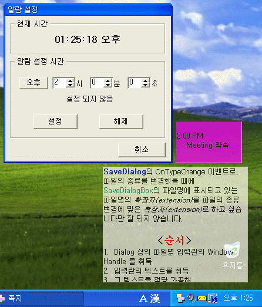

# Sticky

Simple sticky note application for Windows XP and later, and it's inspired by famous Mac app - Stickies.

## Requirement of building
This source code can be compiled in Borland C++ Builder 6.

## Usage
* When you launch the application, app icon will appear in the tray area in Windows.
* Upon right-click on the icon, the menu will show up and you can create new note with that.
* You can create notes as much as you wish.
* Double-clicking the note will change the status of the note between Editing mode and Moving mode.
* In Editing mode, you can write with rich editing features(change fonts, colors, ...).
* In Moving mode, you can move the note with mouse dragging.

## Screenshot

